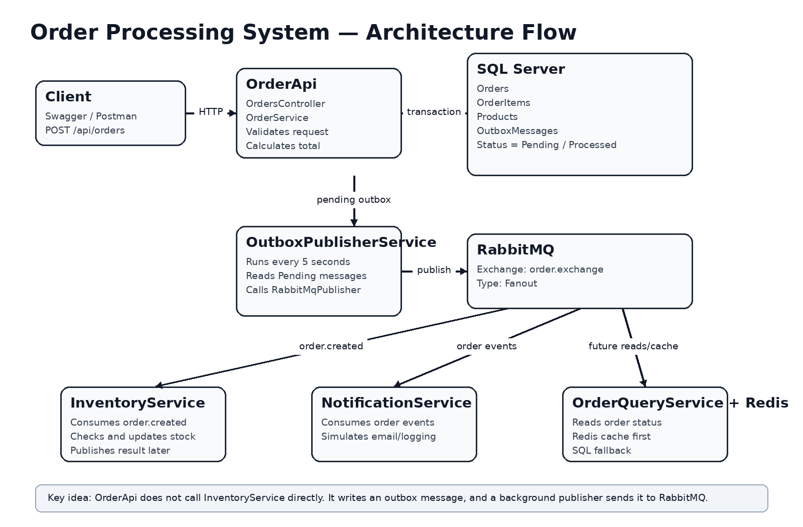

# Order Processing System Architecture

## High-Level Flow

## Order Creation Flow

1. Client sends POST /api/orders
2. OrdersController calls OrderService
3. OrderService saves:
   - Orders
   - OrderItems
   - OutboxMessages
4. Transaction commits

## Event Publishing Flow

1. OutboxPublisherService runs every 5 seconds
2. Reads pending OutboxMessages
3. Calls RabbitMqPublisher
4. Publishes to RabbitMQ exchange
5. Marks message as Processed

## Consumer Flow

RabbitMQ fanout exchange distributes events to:

- InventoryService
- NotificationService
- Future services (Analytics, Billing, etc.)